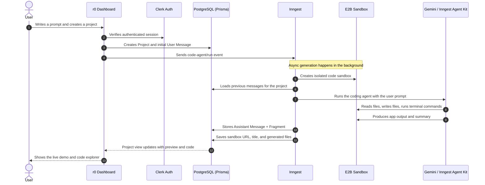

# r0 — AI-Powered Vibe Code Editor

r0 is a full-stack Next.js application that turns natural-language prompts into working app experiences. A signed-in user creates a project, sends a prompt, and an AI coding agent spins up a sandbox, writes files, renders a live preview, and stores the generated code as a reusable fragment.

The experience is intentionally split into two parts:

- A fast prompt-first dashboard for starting new projects and continuing existing ones
- A sandbox workspace where you can inspect the generated preview and browse the code side-by-side

---

## How It Works

The diagram below shows the main r0 flow from prompt submission to sandbox preview:



---

## Features

- **Prompt-first project creation** - Start with a single description and r0 creates a new project thread automatically.
- **Sandboxed AI generation** - The coding agent runs inside an E2B sandbox so generated apps can be previewed safely.
- **Persistent project history** - Each prompt and assistant response is stored as a message inside a project.
- **Preview and code split view** - The project screen uses a resizable two-pane layout for demo and source inspection.
- **File explorer with syntax highlighting** - Generated files are organized in a tree view and rendered with PrismJS.
- **Clickable fragments** - Assistant responses can attach a fragment containing the sandbox URL, generated title, and file map.
- **Auth and onboarding** - Clerk handles sign-in, and the root route group syncs the current user into Prisma on load.
- **Theme support** - Light, dark, and system themes are available from the navbar and project header.
- **Responsive dashboard UI** - The landing page, prompt composer, and project workspace are designed to work on desktop and smaller screens.
- **Background job orchestration** - Inngest handles the async generation flow so the UI stays responsive.
- **Live project refresh** - Message polling and query invalidation keep project threads and fragments up to date.

---

## Tech Stack

### Frontend

- **Next.js 16** - App Router, layouts, server actions, and route handlers
- **React 19** - Component rendering and client interactions
- **Tailwind CSS 4** - Utility-first styling
- **shadcn/ui + Radix UI** - Accessible UI primitives
- **TanStack Query v5** - Client-side data fetching, caching, and refetching
- **next-themes** - Theme switching
- **Lucide React** - Icon set
- **PrismJS** - Code highlighting
- **Streamdown** - Markdown rendering for assistant output

### Backend and Data

- **Prisma ORM v7** - Type-safe database access with generated client output in `src/generated/prisma`
- **PostgreSQL** - Relational data store for users, projects, messages, and fragments
- **Clerk** - Authentication, session handling, and onboarding sync
- **Inngest** - Background job orchestration and event-driven generation
- **E2B Code Interpreter** - Sandboxed runtime for AI-generated apps
- **Google Gemini** - Model provider used by the coding agent

### Utilities

- **date-fns** - Timestamp formatting
- **sonner** - Toast notifications
- **random-word-slugs** - Automatic project name generation

---

## Project Structure

```text
├── src/
│   ├── app/
│   │   ├── (auth)/                 # Clerk sign-in flow and auth shell
│   │   ├── (root)/                 # Main dashboard, loading UI, and project routes
│   │   ├── api/inngest/            # Inngest event handler route
│   │   ├── globals.css             # Global styles and Tailwind entry point
│   │   └── layout.tsx              # Root HTML shell with Clerk, theme, and query providers
│   ├── components/
│   │   ├── home/                   # Landing page hero, navbar, background, and prompt composer
│   │   ├── projects/               # Project dashboard, message thread, file explorer, and preview UI
│   │   ├── providers/              # Theme and React Query providers
│   │   ├── brand/                  # r0 logo
│   │   └── ui/                     # Shared shadcn-style UI primitives
│   ├── features/
│   │   ├── auth/                   # Clerk onboarding and current-user sync
│   │   ├── inngest/                # Inngest client, functions, and helpers
│   │   ├── messages/               # Message CRUD actions and React Query hooks
│   │   └── projects/               # Project CRUD actions, hooks, and fragment helpers
│   ├── generated/prisma/            # Generated Prisma client and model types
│   ├── lib/                        # Shared utilities, database client, and agent prompts
│   └── proxy.ts                    # Clerk route protection rules
├── prisma/                         # Prisma schema and migrations
├── public/                         # Logos and static assets
└── README.md
```

---

## Data Model

The Prisma schema centers on four models:

- **User** - Mirrors the signed-in Clerk user and stores profile details
- **Project** - Represents a prompt-driven workspace owned by a user
- **Message** - Stores the user prompt or assistant response for a project
- **Fragment** - Stores the generated sandbox URL, fragment title, and file map attached to an assistant message

Message records also use two enums:

- **MessageRole** - `USER` or `ASSISTANT`
- **MessageType** - `RESULT` or `ERROR`

Relationships are straightforward:

- One user can own many projects
- One project can contain many messages
- One message can optionally have one fragment

---

## Environment Variables

Create your local environment file from the example:

```bash
cp .env.example .env
```

The project expects these variables:

```env
NEXT_PUBLIC_CLERK_PUBLISHABLE_KEY=
CLERK_SECRET_KEY=
NEXT_PUBLIC_CLERK_SIGN_IN_URL=
NEXT_PUBLIC_CLERK_SIGN_IN_FALLBACK_REDIRECT_URL=
NEXT_PUBLIC_CLERK_SIGN_UP_FALLBACK_REDIRECT_URL=

DATABASE_URL=

INNGEST_DEV=

E2B_API_KEY=

GEMINI_API_KEY=
```

Notes:

- `DATABASE_URL` must point to a PostgreSQL database.
- Clerk is required for auth and onboarding.
- `INNGEST_DEV=1` is useful for local development with the Inngest dev server.
- `E2B_API_KEY` powers the sandbox runtime.
- `GEMINI_API_KEY` powers the agent’s model calls.

---

## Getting Started

### 1. Install Dependencies

```bash
npm install
```

### 2. Set Up Prisma

Generate the Prisma client and apply the local migrations:

```bash
npx prisma generate
npx prisma migrate dev
```

If you are preparing production builds, the app’s build script also runs Prisma generate and deploy-time migrations.

### 3. Start the Dev Server

```bash
npm run dev
```

The app runs at `http://localhost:3000`.

### 4. Optional: Run Inngest Locally

If you want the async generation flow to run locally, start the Inngest dev server in another terminal:

```bash
npx inngest-cli@latest dev
```

The app exposes the Inngest handler at `/api/inngest`.

---

## Using r0

1. Open the app and sign in through Clerk.
2. Describe the app or feature you want to build on the home page.
3. r0 creates a new project and launches the generation job.
4. When the run completes, open the project to see:
   - the assistant response
   - the generated sandbox preview
   - the file explorer and source code
5. Add follow-up prompts to continue iterating on the same project.

---

## Available Scripts

```bash
npm run dev
npm run build
npm run start
npm run lint
```

- `dev` starts the Next.js development server.
- `build` generates Prisma types, applies production migrations, and builds the app.
- `start` runs the production server.
- `lint` runs ESLint.

---

## Implementation Notes

- The landing page uses a glassmorphism navbar, a custom background treatment, and a prompt composer with template suggestions.
- The dashboard uses TanStack Query to keep projects and message threads in sync.
- The project view is split into a left message panel and a right preview/code panel, both resizable.
- File trees are derived from the generated file map and the active file can be copied from the code viewer.
- Clerk route protection is enforced in `src/proxy.ts`, while the root route group syncs the current user record into PostgreSQL.

---

## Deployment Checklist

Before deploying, make sure you have:

- A production PostgreSQL database
- Clerk production keys and redirect URLs
- A production `DATABASE_URL`
- E2B and Gemini API keys
- Inngest configured for your deployed `/api/inngest` route

If you use a platform that runs `npm run build`, ensure the production database is reachable during build because Prisma migrations are part of the build pipeline.

